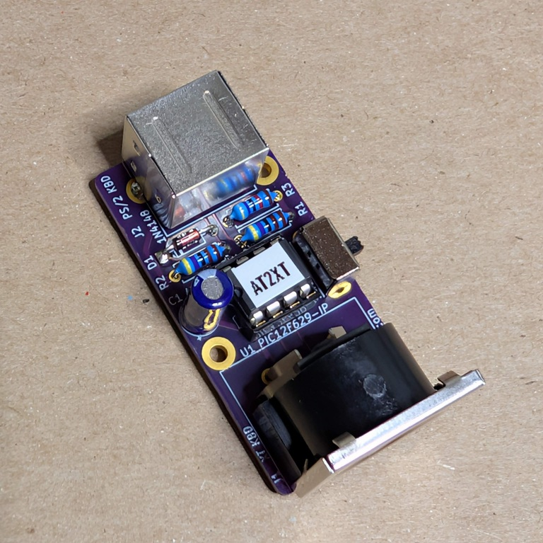
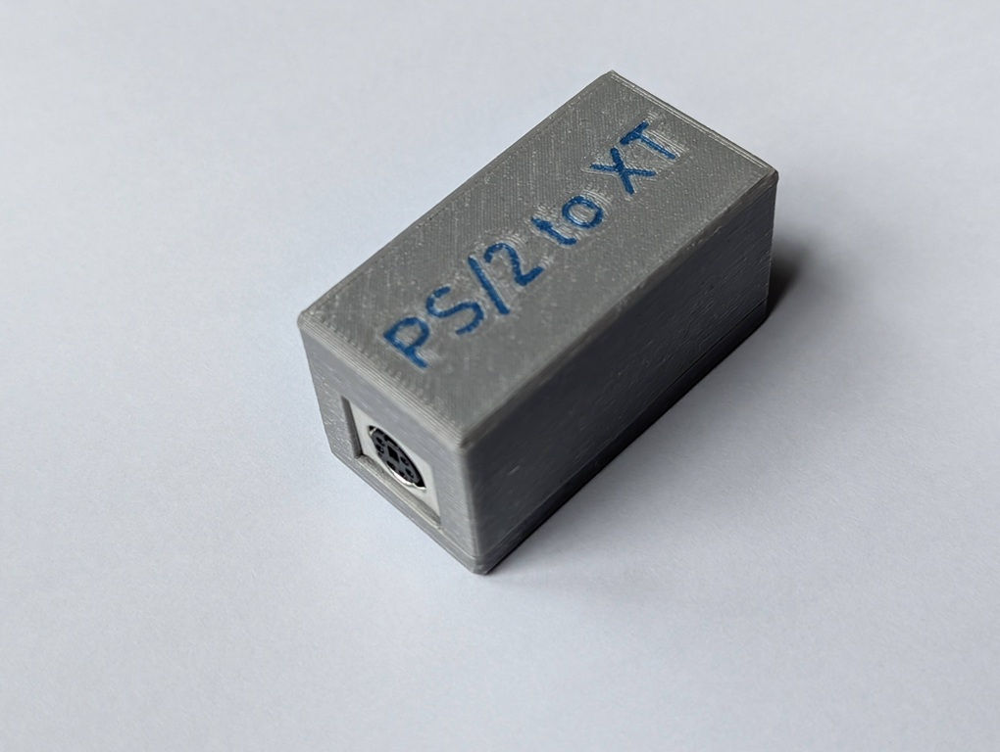

# ps2-xt
PS/2 to XT Keyboard Converter

## Overview

The PS/2 to XT project is yet another PCB design for the [AT2XT keyboard converter](https://forum.vcfed.org/index.php?threads/at2xt-keyboard-converter.26861/) developed by [Vintage Computer Federation](https://vcfed.org/) community.

It allows connecting a PS/2 keyboard to an IBM PC, IBM XT, or compatibles. An AT keyboard with an additional passive AT to PS/2 adapter, or a USB keyboard that also supports AT protocol using passive USB to PS/2 adapter, can be also used with this converter.

It was designed for several reasons:
1. Initially I couldn't find the original PCB design.
2. The original design is somewhat bulky.
3. I wanted a nice 3D printed case to go with it.
4. I wanted an easy to build and service design, with through hole components.
5. A friend asked for one...

## Hardware Documentation

### Schematic and PCB Layout

* [Schematic - Version 1.0](https://github.com/skiselev/ps2-xt/blob/main/KiCad/ps2-xt-1.0-schematic.pdf)
* [PCB Layout - Version 1.0](https://github.com/skiselev/ps2-xt/blob/main/KiCad/ps2-xt-1.0-board.pdf)
* [3D printed case - Version 1.0](https://github.com/skiselev/ps2-xt/tree/main/printed)

### Assembly Instructions

1. Obtain all the parts necessary. Most parts can be purchased from Mouser. The PCB can be ordered from a PCB manufacturer of your choice using provided KiCad and Gerber files.
2. Gather tools and supplies: Soldering iron, small side cutters, needle nose pliers for forming component's leads, solder, solder wick, alcohol and lint free wipes for cleanup. You also will need a programmer to program the firmware into PIC12F629 microcontroller.
3. Start by soldering the D1 1N4148 diode. Bend the leads 90 degrees by holding each side of the diode with the pliers, and gently bending the pins down. When soldering the diode pay attention to the polarity. The black ring mark on the diode should match the white mark on the PCB silkscreen. Trim the leads using the cutters.
4. Solder R1-R3 resistors. Bend the leads 90 degrees down by gently bending them right next to the resistor's package using your fingers. Resistors don't have polarity, but note that R1 and R2 are 4.7k, while R3 is 47k. Trim the leads using the cutters.
5. Solder U1 socket. Pay attention to the socket's orientation. The notch indicating the first pin on the socket should match with the notch on the PCB silkscreen.
6. Solder SW1 switch.
7. Solder C1 capacitor. Pay attention to the polarity. The white stripe on the capacitor should match the white mark on the PCB silkscreen. Trim the leads using the cutters.
8. Solder J2 MiniDIN-6 / PS/2 connector.
9. Solder J1 DIN-5 / XT keyboard connector.
10. Check the soldering work. Clean the flux using some alcohol and wipes.
11. Program U1 PIC12F629 microcontroller and install it into the socket. Pay attention to its orientation.
12. If desired, print and assemble the 3D case using provided STL files.

### Bill of Materials

* [PS2-XT project on Mouser.com](https://www.mouser.com/Tools/Project/Share?AccessID=ace9059e87) - View and order all the components.
* [PS2-XT project on OSH Park](https://oshpark.com/shared_projects/D2kvqnaq) - View and order the PCB.

Component type     | Reference | Description                                 | Quantity | Possible sources and notes 
------------------ | --------- | ------------------------------------------- | -------- | --------------------------
PCB                |           | PS2-XT PCB - Version 1.0                    | 1        | Order from a PCB manufacturer of your choice using provided [Gerber](https://github.com/skiselev/ps2-xt/tree/main/gerber) or [KiCad](https://github.com/skiselev/ps2-xt/tree/main/KiCad) files
Integrated Circuit | U1        | PIC12F629 Microcontroller RTC, 8 pin DIP    | 1        | Mouser [579-PIC12F629IP](https://www.mouser.com/ProductDetail/579-PIC12F629IP)
IC Socket          | U2        | 8 pin DIP                                   | 1        | Mouser [737-ICS-308-T](https://www.mouser.com/ProductDetail/737-ICS-308-T)
Diode              | D1        | 1N4148                                      | 1        | Mouser [512-1N4148TA](https://www.mouser.com/ProductDetail/512-1N4148TA)
Capacitor          | C1        | 47 pF, 25V, electrolythic, 2 mm pitch       | 1        | Mouser [710-860040472001](https://www.mouser.com/ProductDetail/710-860040472001)
Resistor           | R1 - R2   | 4.7 kohm, 0.25 W, 1% tolerance, axial       | 2        | Mouser [603-MFR-25FRF52-4K7](https://www.mouser.com/ProductDetail/603-MFR-25FRF52-4K7)
Resistor           | R3        | 47 kohm, 0.25 W, 1% tolerance, axial        | 1        | Mouser [603-MFR-25FRF52-47K](https://www.mouser.com/ProductDetail/603-MFR-25FRF52-47K)
Connector          | J1        | DIN-5 socket                                | 1        | Mouser [806-KCDX-5S-S2](https://www.mouser.com/ProductDetail/806-KCDX-5S-S2)
Connector          | J2        | MiniDin-6 socket                            | 1        | Mouser [806-KMDGX-6S-BS](https://www.mouser.com/ProductDetail/806-KMDGX-6S-BS)
Switch             | SW1       | Slider SPDT switch                          | 1        | Mouser [179-SLW8645872ARAND](https://www.mouser.com/ProductDetail/179-SLW8645872ARAND)

## Additional Photos

### Complete PS/2 to XT in a Case

### Both Sides of the Assembled Boards

## Release Notes

### Changes

### Known Issues

* Version 1.0
  * No known issues

### Wishlist
* Use smaller footprint for the DIN-5. Reduce the PCB size.

## Red Tape

### Licensing

The hardware design itself, including schematic, PCB layout design, and 3D printed case design files are licensed under the strongly-reciprocal variant of [CERN Open Hardware Licence version 2](license-cern_ohl_s_v2.txt). Documentation, including this file, is licensed under the [Creative Commons Attribution-ShareAlike 4.0 International License](license-cc-by-sa-4.0.txt).
